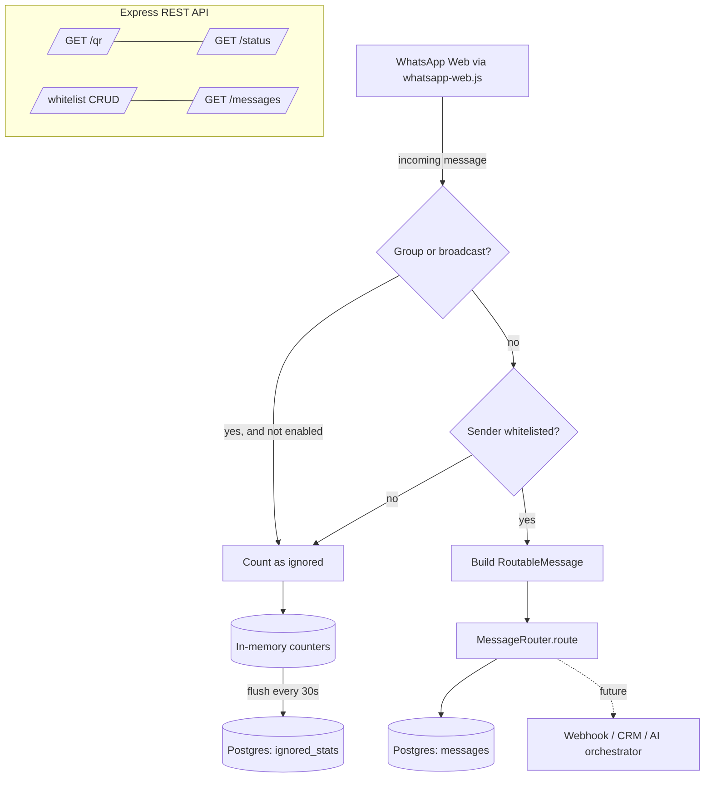

# WhatsApp Manager

A **personal** WhatsApp Web monitoring service. It logs into *your* WhatsApp via
QR code, listens for incoming messages, and **only processes messages from
whitelisted numbers** — everything else is counted and dropped. Outbound sending
is **off by default**.

> ⚠️ This is for monitoring your own personal WhatsApp. It is not for spam,
> scraping, mass messaging, or marketing. Outbound is disabled unless you
> explicitly turn it on.

> 📘 **Setting up on a new machine?** Start with
> [`docs/setup.md`](./docs/setup.md) — a full install walkthrough (database,
> `.env`, **authentication**, first run, Docker). Auth deep-dive:
> [`docs/authentication.md`](./docs/authentication.md).

## Features

- 🔐 **QR login** — shown in the terminal *and* at `http://localhost:3000/qr`.
- 💾 **Session persistence** — scan once; the session is reused across restarts.
- ✅ **Whitelist** — only messages from allowed numbers are stored. Managed via REST, or
  browse real WhatsApp conversations and check-select several at once (`GET /contacts`).
- 📥 **Full two-sided capture** — inbound *and* your own outbound messages to whitelisted
  contacts, keyed by contact for a complete thread. Non-whitelisted traffic is only counted.
- 🕓 **History backfill** — pull past conversation history per contact (with an optional
  date range) via `POST /backfill`, bounded by what WhatsApp synced to this device.
- 🔄 **Auto catch-up** — on every reconnect (e.g. after your PC was off), each whitelisted
  contact is automatically backfilled from its own last captured message, closing any gap
  with no manual step.
- 📎 **Media archival** — images / voice notes / audio / video / documents are downloaded
  to local disk (`MEDIA_STORAGE_PATH`) and served back via `GET /messages/:id/media`.
- 🎙️ **Transcription** — whitelisted voice notes/audio are auto-transcribed to their
  original language via OpenAI (background worker; enable with `ENABLE_TRANSCRIPTION`).
- 🌐 **On-demand translation** — `POST /messages/:id/translate` renders body + transcript
  into English (via DeepSeek) and stores it alongside the original.
- 🔑 **Encrypted credentials** — provider API keys are stored AES-256-GCM encrypted in
  Postgres (master key `CREDENTIALS_ENCRYPTION_KEY`), managed over `/credentials`.
- 💬 **Conversations view** — WhatsApp-style chat bubbles per whitelisted contact, sorted
  by last message, with a "Translate all" action per thread.
- 💵 **Cost tracking** — per-call OpenAI/DeepSeek spend on the Costs page + a dashboard
  KPI (`GET /costs/summary`). Rates are configurable estimates — verify against current
  provider pricing.
- 😀 **Reactions, edits & deletes** — emoji reactions are captured live and shown as
  chips on the bubbles; in-place edits update the stored body (`edited_at`), and
  "delete for everyone" soft-deletes with the content retained.
- ⌨️ **Typing indicator** — while you compose a reply the recipient sees "typing…"
  in WhatsApp (`POST /messages/:number/typing`; only when outbound is enabled).
- 🚨 **Ops alerts** — point `ALERT_WEBHOOK_URL` at an ntfy topic and get a phone push
  when the client is terminally down (reconnect exhausted / device unlinked / auth
  failure) and when it recovers — the one channel that works when WhatsApp itself is dead.
- 📱 **Mobile + PWA** — responsive layout (drawer nav, stacked conversations with a
  back button) and an installable app shell (manifest + no-cache service worker).
- 🧮 **Ignored = counters only** — non-whitelisted traffic is counted, never stored with content.
- 🚦 **Safety first** — `ENABLE_OUTBOUND=false`, rate-limited outbound scaffold, no bulk sending.
- 🔌 **`MessageRouter` seam** — swap storage for webhook / CRM / AI orchestrator without touching ingestion.

## How it works



## Requirements

- Node.js 20+ (tested on 24)
- PostgreSQL 14+ (a local instance, or use the bundled `docker-compose`)
- Chromium — bundled automatically inside Docker; for local `npm run dev`,
  `whatsapp-web.js` downloads its own Chromium on install.

## Quick start (local)

```bash
# 1. Install
npm install

# 2. Configure
cp .env.example .env
#   The defaults point at a local Postgres on :42016 (user/pass postgres/postgres).
#   Adjust PGHOST/PGPORT/... or set DATABASE_URL to match your setup.

# 3. Create the database (one time)
createdb -h localhost -p 42016 -U postgres whatsapp_manager
#   ...or: psql -h localhost -p 42016 -U postgres -c "CREATE DATABASE whatsapp_manager;"

# 4. Run (migrations run automatically on boot)
npm run dev
```

Then open **http://localhost:3000/qr** (or read the QR printed in the terminal)
and scan it in WhatsApp: **Settings → Linked devices → Link a device**.

Once the log says `WhatsApp client is READY`, the session is saved under
`./.wwebjs_auth` and you won't need to scan again next time.

## Quick start (Docker)

```bash
docker compose up --build
# QR appears in the container logs and at http://localhost:3000/qr
docker compose logs -f app
```

The WhatsApp session lives in the `wa_session` volume, so restarts keep you
logged in.

## Test it with one whitelisted number

```bash
# Add your own (or a friend's) number — digits only, with country code.
curl -X POST http://localhost:3000/whitelist \
  -H 'Content-Type: application/json' \
  -d '{"number":"14155550100","label":"me"}'

# List the whitelist
curl http://localhost:3000/whitelist

# Now send a WhatsApp message FROM that number to your account.
# It should be captured:
curl http://localhost:3000/messages
curl http://localhost:3000/messages/14155550100

# Check connection + ignored counters
curl http://localhost:3000/status

# Remove from whitelist
curl -X DELETE http://localhost:3000/whitelist/14155550100
```

Messages from any number **not** on the whitelist won't appear in `/messages`;
they only bump the `ignored` counters visible in `/status`.

## API

| Method & path              | Description                                            |
| -------------------------- | ------------------------------------------------------ |
| `GET /health`              | Liveness probe (always public).                        |
| `GET /qr`                  | QR login page (HTML). `?format=json` for raw QR/data URL. |
| `GET /status`              | Connection state, whitelist size, ignored counters.    |
| `GET /contacts`            | Real WhatsApp conversations, flagged whitelisted/not — for the picker. |
| `GET /whitelist`           | List allowed numbers.                                  |
| `POST /whitelist`          | Add `{ "number": "...", "label": "..." }`.             |
| `DELETE /whitelist/:number`| Remove a number.                                       |
| `GET /messages`            | Recent captured messages (`?limit=&offset=`).          |
| `GET /messages/threads`    | One row per whitelisted contact + their latest message, sorted by recency. |
| `GET /messages/:number`    | Full thread for one contact (inbound + outbound).      |
| `POST /messages/:id/translate` | Translate body + transcript to English (DeepSeek). |
| `POST /messages/:number/translate-all` | Translate every not-yet-translated message in a contact's thread. |
| `GET /messages/:id/media`  | Stream the message's downloaded attachment.            |
| `POST /backfill`           | Backfill history for all whitelisted contacts. Body: optional `{ from, to }`. |
| `POST /backfill/:number`   | Backfill history for one contact (optional `{ from, to }`). |
| `GET /backfill/status`     | Progress of the running/last backfill.                 |
| `GET /credentials`         | List stored API keys (masked — name + last4 only).     |
| `PUT /credentials/:name`   | Store/replace an encrypted key: `{ "value": "sk-…" }`. |
| `DELETE /credentials/:name`| Remove a stored key.                                   |
| `GET /costs/summary`       | Monthly + all-time cost totals per provider.           |
| `GET /costs/daily`         | Per-day, per-provider cost totals (`?days=30`).        |
| `GET /costs`               | Recent individual cost entries (`?limit=100`).         |
| `POST /outbound/send`      | **Disabled by default.** Guarded, rate-limited scaffold. |

### Authentication

Two independent credentials, off by default:

1. **Personal login** (browser UI) — set `JWT_SECRET`, `AUTH_USERNAME`, and
   `AUTH_PASSWORD_HASH` to require a login. Generate the hash with
   `npm run hash-password -- "your password"`. `POST /auth/login` returns a
   **forever-JWT** (no expiry) sent as `Authorization: Bearer <jwt>` — so you log
   in once per browser and stay in until you log out or rotate `JWT_SECRET`.
   Element/navigation/SSE URLs (media, export, `/events`) carry it as
   `?access_token=<jwt>`. When `JWT_SECRET` is set, auth is enforced on every
   endpoint except `/health` and `POST /auth/login`.
2. **External API key** — set `API_KEY`, sent as `x-api-key: <key>` (or
   `?api_key=<key>`). When a personal login is configured, the API key is
   **read-only** (GET endpoints only; writes return `403`) — for an outside agent
   that reads the surface but can't send outbound, edit the whitelist/groups, run
   backfill, or touch credentials. With `JWT_SECRET` empty, `API_KEY` is the sole
   credential and grants full access (backward-compatible).

Leave all of the above empty for open local use.

## Configuration

See [`.env.example`](./.env.example). Key flags:

| Var                 | Default            | Meaning                                          |
| ------------------- | ------------------ | ------------------------------------------------ |
| `ENABLE_OUTBOUND`   | `false`            | Master switch for any sending. Keep off.         |
| `MONITOR_GROUPS`    | `false`            | Also process group chats (matched by sender).    |
| `SESSION_DATA_PATH` | `./.wwebjs_auth`   | Where the WhatsApp session is persisted.         |
| `JWT_SECRET`        | *(empty)*          | Enables personal login (forever-JWT) when set.   |
| `AUTH_USERNAME` / `AUTH_PASSWORD_HASH` | *(empty)* | Personal login creds (`npm run hash-password`). |
| `API_KEY`           | *(empty)*          | External key. Read-only when a personal login exists. |
| `OUTBOUND_RATE_LIMIT_MAX` | `10`         | Max outbound calls per window (future use).      |
| `CREDENTIALS_ENCRYPTION_KEY` | *(empty)* | Master key for the encrypted credentials store (`openssl rand -base64 32`). |
| `ENABLE_TRANSCRIPTION` | `false`         | Auto-transcribe whitelisted audio via OpenAI.    |
| `TRANSCRIPTION_MODEL` | `gpt-4o-transcribe` | OpenAI transcription model.                   |
| `TRANSLATION_MODEL` | `deepseek-chat`    | Exact DeepSeek model id used for translation.    |
| `MEDIA_STORAGE_PATH` | `./media`         | Where downloaded attachments are stored.         |
| `BACKFILL_LIMIT_PER_CHAT` | `1000`       | Per-chat history cap (`0` = all available).      |

### Enrichment & credentials

Media download and full-thread capture work out of the box. Transcription and
translation need provider keys — store them **encrypted** rather than in `.env`:

```bash
# 1. Set a master key once (in .env), then restart:
#    CREDENTIALS_ENCRYPTION_KEY=$(openssl rand -base64 32)

# 2. Store provider keys (encrypted at rest; only last4 is ever returned):
curl -X PUT http://localhost:3000/credentials/openai   -H 'Content-Type: application/json' -d '{"value":"sk-..."}'
curl -X PUT http://localhost:3000/credentials/deepseek -H 'Content-Type: application/json' -d '{"value":"sk-..."}'

# 3. Turn on auto-transcription (in .env): ENABLE_TRANSCRIPTION=true
# 4. Pull history for a contact, then translate a message on demand:
curl -X POST http://localhost:3000/backfill/14155550100 -H 'Content-Type: application/json' -d '{"from":"2025-01-01"}'
curl -X POST http://localhost:3000/messages/42/translate
```

> **History depth is limited by WhatsApp.** A linked device only receives a
> bounded window of history, so backfill reaches "as much as WhatsApp synced,"
> not the entire lifetime of a chat. `GET /backfill/status` reports what it found.

## Project structure

```
src/
  app.ts                     # Express bootstrap, migrations, shutdown
  config/env.ts              # Validated environment config (zod)
  logger.ts                  # Shared pino logger (content is never logged)
  db/
    index.ts                 # pg pool + query helpers
    migrate.ts               # tiny forward-only migration runner
    migrations/001_init.sql  # schema
  whitelist/
    whitelist.service.ts     # cached whitelist + CRUD
    whitelist.routes.ts
  messages/
    message.model.ts         # RoutableMessage / StoredMessage types
    message.service.ts       # persistence + queries
    message.routes.ts
    ignored-stats.ts         # in-memory counters for dropped traffic
  router/
    message-router.ts        # MessageRouter interface + Storage/Composite impls
  whatsapp/
    client.ts                # owns the whatsapp-web.js Client + state
    events.ts                # qr/ready/message handlers + whitelist policy
    qr.ts                    # terminal + web QR rendering
    whatsapp.routes.ts       # /qr, /status
  outbound/
    outbound.routes.ts       # guarded, rate-limited outbound scaffold
  utils/phone.ts             # number normalization
```

## Extending: the `MessageRouter`

`src/router/message-router.ts` is the one place downstream integrations plug in.
Implement the interface and add it to the composite:

```ts
class WebhookMessageRouter implements MessageRouter {
  constructor(private url: string) {}
  async route(m: RoutableMessage) {
    await fetch(this.url, { method: 'POST', body: JSON.stringify(m) });
  }
}

export const messageRouter = new CompositeMessageRouter([
  new StorageMessageRouter(),
  new WebhookMessageRouter(process.env.WEBHOOK_URL!),
]);
```

Ingestion code never changes.

## Troubleshooting

### "Couldn't link device, try again later"

WhatsApp rejects the link when the web-client build presented by the library is
too old. This service already loads a **current** build (see `WA_WEB_VERSION`),
which fixes it in the vast majority of cases. If you still hit it:

1. **Start from a clean session** — a half-finished link leaves stale files:
   ```bash
   rm -rf .wwebjs_auth .wwebjs_cache   # (Docker: docker compose down -v)
   ```
2. **Don't hammer it.** Repeated failed scans trigger a short WhatsApp-side
   cooldown. Wait ~15–30 minutes, then start fresh and scan promptly.
3. **Bump the WA Web build.** If it's been a while, grab the newest file from
   [wppconnect/wa-version `/html`](https://github.com/wppconnect-team/wa-version/tree/main/html)
   and set `WA_WEB_VERSION` to it (filename without `.html`), then restart.
4. **Check outbound network.** The build is fetched from
   `raw.githubusercontent.com` at startup — make sure that host is reachable
   (relevant behind strict firewalls / in Docker).
5. Make sure your phone has a working internet connection while scanning.

## Notes & caveats

- `whatsapp-web.js` is an unofficial library that drives WhatsApp Web through a
  headless browser. WhatsApp may change their web app and temporarily break it;
  if login misbehaves, upgrade the package.
- Keep this to your **own** account and **your own** contacts.
- The `.wwebjs_auth/` folder contains your live session — it's git-ignored; never
  commit or share it.

## Scripts

| Script            | Does                                        |
| ----------------- | ------------------------------------------- |
| `npm run dev`     | Watch-mode dev server (tsx).                |
| `npm run build`   | Compile TypeScript + copy SQL to `dist/`.   |
| `npm start`       | Run the compiled server.                    |
| `npm run migrate` | Run DB migrations only.                     |
| `npm run typecheck` | Type-check without emitting.              |
```
