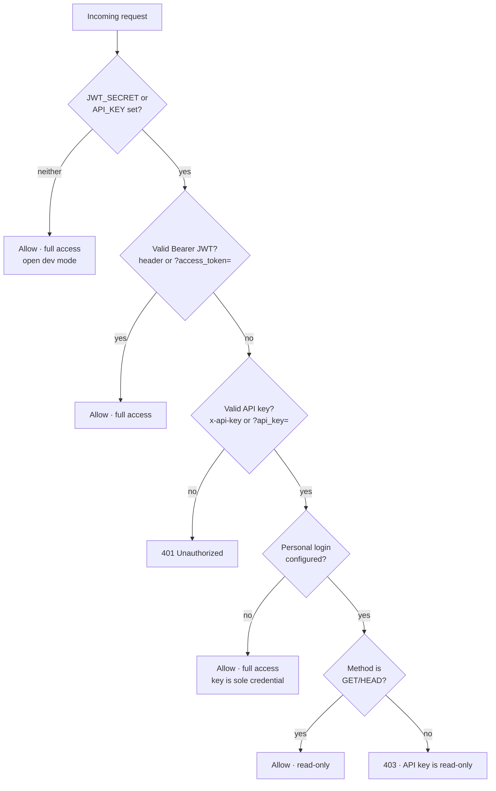

# Authentication

Two independent credentials, each with its own capability level:

| Credential | Who it's for | Access | Sent as |
| --- | --- | --- | --- |
| **Personal login (JWT)** | You, in the browser | **Full** (read + write + send) | `Authorization: Bearer <jwt>` — or `?access_token=<jwt>` on media/export/SSE URLs |
| **External API key** | An outside agent/script | **Read-only** (GET only) | `x-api-key: <key>` — or `?api_key=<key>` |

Both are **off by default**: with neither configured, the API is open (fine for
local use). Auth is a per-credential capability layer — pair it with a network
restriction (localhost/firewall) as the outer wall.

## How the guard decides

Every request except `/health` and `POST /auth/login` passes through one guard
([`src/auth/auth.middleware.ts`](../src/auth/auth.middleware.ts)):



The key rule: the API key is **read-only only when a personal login exists to
hold full access**. Without `JWT_SECRET`, `API_KEY` is the sole credential and
keeps full access (backward-compatible with the pre-auth behavior).

## Personal login

### Configure

```bash
openssl rand -base64 32                      # → JWT_SECRET
npm run hash-password -- "your password"     # → AUTH_PASSWORD_HASH
```

```dotenv
JWT_SECRET=<random secret>
AUTH_USERNAME=yourname
AUTH_PASSWORD_HASH=scrypt$...$...
```

- The password is stored as an **scrypt hash** (never plaintext). Regenerate the
  hash to change the password; restart to pick it up.
- Single user by design (this is a personal service — no users table).

### The forever-token

`POST /auth/login` returns a **JWT with no expiry** (HS256, signed with
`JWT_SECRET`). The browser stores it in `localStorage`, so:

- You **log in once per browser** and stay in across reloads and restarts.
- No "trusted machine" prompt, no periodic re-login.

You get signed out only when you **Logout** (top-right icon — clears the token),
or when the token stops verifying (see rotation below). A different browser or
cleared storage means logging in again.

### Log in from a script

```bash
# 1. Exchange credentials for a token
TOKEN=$(curl -s -X POST http://localhost:3000/auth/login \
  -H 'Content-Type: application/json' \
  -d '{"username":"yourname","password":"your password"}' | jq -r .data.token)

# 2. Use it as a Bearer token (full access)
curl http://localhost:3000/status -H "Authorization: Bearer $TOKEN"
```

`GET /auth/me` echoes the resolved caller (`{ authenticated, kind, username }`) —
the frontend uses it on boot to confirm the stored token is still valid.

## External API key

### Configure

```dotenv
API_KEY=<a long random string>
```

### What it can and can't do

Read-only = **GET endpoints only** whenever a personal login is configured.
Any write returns `403 { "error": "API key is read-only" }`.

| ✅ Allowed (GET) | 🚫 Blocked (non-GET) |
| --- | --- |
| List/read messages, threads, search | Send outbound (`POST /outbound/send`) |
| Export a thread, fetch media | Add/remove whitelist or groups |
| Costs, stats, status, QR | Trigger backfill |
| `GET /events` (SSE stream) | Add/delete credentials |
| | Translate / summarize / draft-reply (they're `POST`) |

```bash
# Read — 200
curl http://localhost:3000/messages -H 'x-api-key: <key>'

# Write — 403
curl -X POST http://localhost:3000/whitelist -H 'x-api-key: <key>' \
  -H 'Content-Type: application/json' -d '{"number":"+1..."}'
```

> Need the agent to hit a specific write endpoint later (e.g. on-demand
> translate)? That's a small allow-list tweak to the guard's read-only rule —
> it's deliberately GET-only for now.

## Query-param credentials (media / export / SSE)

Browsers can't set headers on ``/`<audio>` sources, `<a download>`
navigations, or `EventSource`. For those, the credential rides as a query param
instead — the guard accepts both:

- JWT → `?access_token=<jwt>`
- API key → `?api_key=<key>`

The frontend does this automatically for media, export, and the `/events` stream.

## Rotation & revocation

Tokens never expire, so **rotating `JWT_SECRET` is your revoke button**:

1. Change `JWT_SECRET` in `.env` and restart the backend.
2. Every previously issued token now fails to verify → all sessions get a `401`
   and are bounced to the login screen.
3. Log in again to mint a fresh token.

Rotate the **API key** by changing `API_KEY` and restarting; update the agent.

## Security notes

- **Forever + localStorage is a deliberate tradeoff.** A stolen token is valid
  until you rotate the secret. Acceptable for a personal, network-restricted
  tool — rotate `JWT_SECRET` if you suspect exposure.
- **Serve over HTTPS** in production — the token travels in headers and, for
  media/SSE, in query strings.
- **No new dependencies:** the JWT (HS256) and password hashing (scrypt) are
  implemented with Node's `crypto`, matching the existing
  [`crypto/secret-box.ts`](../src/crypto/secret-box.ts). The guard always
  verifies with HMAC-SHA256 and ignores the token's own `alg` header, so the
  `alg:none` forgery does not apply.
