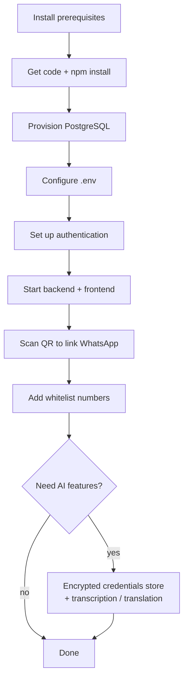

# Setup — new installation

End-to-end guide to standing up WhatsApp Manager on a fresh machine: install,
database, configuration, **authentication**, first run, and the optional
subsystems. For the auth deep-dive see [`authentication.md`](./authentication.md);
for the allow-list see [`whitelist.md`](./whitelist.md).



## 1. Prerequisites

| Requirement | Notes |
| --- | --- |
| **Node.js 20+** | 22 recommended. `node -v` to check. |
| **PostgreSQL 14+** | A reachable instance. Migrations run automatically on boot. |
| **Chromium + libs** | `whatsapp-web.js` drives a headless browser. On Docker it's installed for you; on bare metal install system Chromium (see below). |
| **OpenSSL** | For generating secrets (`openssl rand -base64 32`). Standard on Linux/macOS. |

> **Two apps, two `node_modules`.** The backend lives at the repo root; the
> frontend lives in `frontend/`. Install and run them separately.

Bare-metal Chromium libraries (Debian/Ubuntu example — the [`Dockerfile`](../Dockerfile) lists the full set):

```bash
sudo apt-get install -y chromium ca-certificates fonts-liberation \
  libnss3 libatk-bridge2.0-0 libatk1.0-0 libcups2 libdrm2 libgbm1 \
  libgtk-3-0 libx11-xcb1 libxcomposite1 libxdamage1 libxrandr2 \
  libasound2 libpangocairo-1.0-0
```

Then point the app at it in `.env`: `PUPPETEER_EXECUTABLE_PATH=/usr/bin/chromium`.

## 2. Get the code & install

```bash
git clone <repo-url> whatsapp_manager
cd whatsapp_manager

# Backend (repo root)
npm install

# Frontend
cd frontend && npm install && cd ..
```

## 3. Provision PostgreSQL

Create a database and a user the app can reach. Example:

```bash
sudo -u postgres psql <<'SQL'
CREATE DATABASE whatsapp_manager;
CREATE USER wa_user WITH PASSWORD 'change-me';
GRANT ALL PRIVILEGES ON DATABASE whatsapp_manager TO wa_user;
SQL
```

You do **not** run migrations by hand — they are forward-only `*.sql` files that
apply automatically (and idempotently) on every boot. To apply them standalone:

```bash
npm run migrate
```

## 4. Configure `.env`

Copy the template and edit it. Every variable is documented inline in
[`.env.example`](../.env.example).

```bash
cp .env.example .env
```

The essentials for a first boot:

| Variable | What to set |
| --- | --- |
| `PGHOST` / `PGPORT` / `PGUSER` / `PGPASSWORD` / `PGDATABASE` | Your Postgres connection. Or set a single `DATABASE_URL` (it wins over the discrete vars). |
| `PORT` | Backend HTTP port (default `3000`). |
| `WA_WEB_VERSION` | Leave as-is unless linking fails (see [README troubleshooting](../README.md#troubleshooting)). |
| `PUPPETEER_EXECUTABLE_PATH` | Only on bare metal with system Chromium. |

Everything else (auth, AI, webhook, groups, costs) is optional and covered below.

## 5. Set up authentication

Two independent credentials, **both off by default** (open API for local use).
Full details and the security model are in [`authentication.md`](./authentication.md).

### Personal login (browser UI) — log in once, forever

```bash
# 1. A signing secret (any long random string)
openssl rand -base64 32        # → paste as JWT_SECRET

# 2. A password hash for your account
npm run hash-password -- "your password"   # → paste as AUTH_PASSWORD_HASH
```

In `.env`:

```dotenv
JWT_SECRET=<the openssl output>
AUTH_USERNAME=yourname
AUTH_PASSWORD_HASH=<the hash output>
```

When `JWT_SECRET` is set the whole API requires auth (except `/health` and
`POST /auth/login`). The UI shows a login screen; after you sign in, the token is
stored in the browser and **never expires** — you stay logged in until you click
Logout or rotate `JWT_SECRET`.

### External API key (optional) — for an outside agent

```dotenv
API_KEY=<a long random string>
```

When a personal login is configured, this key is **read-only** (GET endpoints
only). Sent as `x-api-key: <key>` (or `?api_key=<key>`). See
[`authentication.md`](./authentication.md) for exactly what it can and can't do.

## 6. First run

Two dev servers: the backend (`:3000`) and the Vite frontend (`:5173`, which
proxies API calls to the backend).

```bash
# Option A — both at once in a tmux session (recommended)
./debug.sh          # session "wm-debug", split panes, watch-mode auto-reload

# Option B — two terminals
npm run dev                 # terminal 1 (backend)
cd frontend && npm run dev  # terminal 2 (frontend)
```

Open **http://localhost:5173** for the UI (or the backend directly at
`http://localhost:3000`).

## 7. Link your WhatsApp account

On first boot there's no session yet. Scan the QR:

- **UI:** the Connection page shows it, or
- **Direct:** `http://localhost:3000/qr` (HTML), or `GET /qr?format=json` for the raw data URL.

Open WhatsApp on your phone → **Settings → Linked Devices → Link a Device** and
scan. The session persists under `SESSION_DATA_PATH` (`./.wwebjs_auth`), so you
won't rescan on restart.

## 8. Add whitelist numbers

**Only 1:1 messages with whitelisted numbers are stored.** Add yours from the
Whitelist page or via the API — see [`whitelist.md`](./whitelist.md). Everything
else is counted and dropped.

## 9. Optional subsystems

Enable only what you need. Each is inert until configured.

### Encrypted credentials store (recommended for AI keys)

Rather than putting provider keys in `.env` in plaintext, store them encrypted at
rest (AES-256-GCM in Postgres):

```bash
openssl rand -base64 32     # → CREDENTIALS_ENCRYPTION_KEY in .env
```

Then add keys via the API (or the Settings → Credentials UI). The store name is
the identifier in the path:

```bash
curl -X PUT http://localhost:3000/credentials/openai   -H 'Content-Type: application/json' -d '{"value":"sk-..."}'
curl -X PUT http://localhost:3000/credentials/deepseek -H 'Content-Type: application/json' -d '{"value":"sk-..."}'
curl -X PUT http://localhost:3000/credentials/ezy_portal -H 'Content-Type: application/json' -d '{"value":"..."}'
```

> ⚠️ **Back up `CREDENTIALS_ENCRYPTION_KEY`.** Lose it and the stored keys are
> unrecoverable (you'd just re-enter them). The API only ever returns the last 4
> characters, never plaintext.

If the store is disabled, the plaintext `OPENAI_API_KEY` / `DEEPSEEK_API_KEY`
env vars are used as a fallback.

### Audio transcription (OpenAI)

```dotenv
ENABLE_TRANSCRIPTION=true
```
A background worker transcribes whitelisted voice notes/audio. Needs an OpenAI
key (store or env). Model + batch size are configurable (`TRANSCRIPTION_MODEL`,
`TRANSCRIPTION_BATCH`).

### Translation & summaries (on demand)

Translation (DeepSeek) and conversation summaries (OpenAI vision model) are
triggered from the UI/API — no flag, just a configured key. Tune with
`TRANSLATION_MODEL`, `TARGET_LANGUAGE`, `SUMMARY_MODEL`, `SUMMARY_MAX_IMAGES`.

### Monitored group chats

Groups are ignored unless explicitly added to the registry (Whitelist page →
"Add group conversations"). Once monitored, **every** member's message in that
group is stored. `MONITOR_GROUPS` is a legacy flag; use the registry instead.

### Outbound webhook (push instead of poll)

```dotenv
WEBHOOK_URL=https://your-agent.example.com/hook
WEBHOOK_SECRET=<hmac signing secret>   # optional; adds X-Signature
```
Every captured message is POSTed as JSON. Best-effort — failures never block
persistence.

### Outbound sending (kept off)

`ENABLE_OUTBOUND` is a hard gate, off by default, and even when on it's
rate-limited and single-recipient. Leave it `false` unless you specifically need
to send.

### EZY Portal linking

Link WhatsApp contacts/groups to EZY Portal business partners. Set
`EZY_PORTAL_BASE_URL` (defaults to the production account API) and store the
tenant key under `ezy_portal` in the credentials store.

## 10. Production build & serve

The backend does **not** serve the frontend — build the SPA and serve it
statically, with a reverse proxy forwarding the API prefixes to the backend
(same-origin, so no CORS is needed — the app ships no CORS middleware).

```bash
# Backend
npm run build && npm start          # compiles to dist/, runs dist/app.js

# Frontend
cd frontend && npm run build        # → frontend/dist (static files)
```

Reverse-proxy sketch (nginx): serve `frontend/dist` and proxy the API prefixes to
the backend on `:3000`.

```nginx
server {
  root /path/to/frontend/dist;
  location / { try_files $uri /index.html; }   # SPA fallback

  # Proxy every backend prefix to the API.
  location ~ ^/(auth|status|qr|whitelist|messages|outbound|health|credentials|backfill|costs|contacts|groups|ezy-portal|events) {
    proxy_pass http://127.0.0.1:3000;
    proxy_set_header Host $host;
    proxy_buffering off;        # required for the /events SSE stream
  }
}
```

## 11. Docker (all-in-one)

[`docker-compose.yml`](../docker-compose.yml) brings up Postgres + the backend
together (frontend is not containerized — build/serve it separately, or just use
the REST API):

```bash
docker compose up --build
```

- Postgres is exposed on host `:5433`; the app on `:3000`.
- Volumes persist the WhatsApp session (`wa_session`) and media (`wa_media`).
- Set auth/AI env under the `app` service's `environment:` block (there are
  commented placeholders for `API_KEY`, `CREDENTIALS_ENCRYPTION_KEY`, etc.).

## 12. Production hardening checklist

- [ ] **Enable auth** — set `JWT_SECRET` + `AUTH_USERNAME` + `AUTH_PASSWORD_HASH`. Never expose the API unauthenticated off localhost.
- [ ] **Restrict the network** — bind to localhost or firewall it to your own IP. Auth is the inner wall; the network is the outer one.
- [ ] **Use the read-only API key** for any external agent, not your personal login.
- [ ] **Back up** `CREDENTIALS_ENCRYPTION_KEY`, the `.env`, and the `.wwebjs_auth/` session folder.
- [ ] **Rotate to revoke** — changing `JWT_SECRET` invalidates every issued token (your only lever, since tokens never expire).
- [ ] **Serve over HTTPS** in front of the reverse proxy — the JWT rides in headers and `?access_token=` query params.

Troubleshooting (QR won't link, DB down, etc.) is in the
[README](../README.md#troubleshooting).
