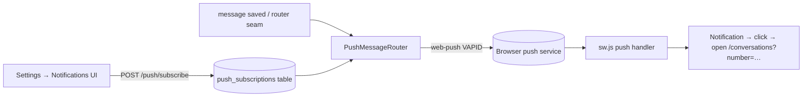

# Web Push notifications — implementation spec (not yet built)

Status: **proposed**. The PWA shell (manifest + service worker + responsive
layout) shipped 2026-07-16; this spec covers the missing piece — notifications
that arrive **without an open dashboard tab**. It is a net-new schema + API +
UI feature, so it is delivered plan-first per project convention.

## Why

The current browser notifications (`useNotifications.ts`) fire from the SSE
handler, which only exists while a dashboard tab is open. On a phone (the PWA
use case) that is almost never true. Web Push inverts the flow: the backend
pushes to the browser's push service, and the **service worker** shows the
notification with no tab at all.

## Architecture

Fan-out belongs on the existing `MessageRouter` seam (a `PushMessageRouter` in
the `CompositeMessageRouter`), NOT inside `events.ts` — same rule as the
webhook router. Reuse the notification *policy* already encoded in
`useSse.ts`: inbound only, respect `metadata.chatMuted` unless `mentionsMe`.

## Phases

### Phase 1 — schema + keys
- Migration `0NN_push_subscriptions.sql`:
  `push_subscriptions(id, endpoint UNIQUE, p256dh, auth, user_agent, created_at, last_seen_at)`.
- Env: `VAPID_PUBLIC_KEY`, `VAPID_PRIVATE_KEY`, `VAPID_SUBJECT` (mailto:).
  Generate once with `npx web-push generate-vapid-keys`. Unset ⇒ feature off
  (mirrors `ALERT_WEBHOOK_URL` gating).
- Dependency decision: the `web-push` npm package is the one new backend dep
  (payload encryption RFC 8291 is not worth hand-rolling). This violates the
  "no new deps" frontend rule's spirit — flag it at review; frontend needs none.

### Phase 2 — API + router
- `push.service.ts` owns the table's SQL (service-owns-its-SQL rule).
- Routes: `GET /push/public-key`, `POST /push/subscribe` (upsert by endpoint),
  `DELETE /push/subscribe` (by endpoint). JWT-guarded (personal scope only —
  the read-only API key must NOT manage subscriptions).
- `PushMessageRouter`: on inbound routable messages, send
  `{title, body, tag: contactNumber, url}` to every subscription;
  prune on 404/410 responses. `Promise.allSettled`, never blocks persistence.
- Redaction: push payloads transit Mozilla/Google push services **encrypted**
  (RFC 8291), so message previews are acceptable — but offer
  `PUSH_PREVIEW=false` env to send "New message" only.

### Phase 3 — service worker + UI
- `sw.js`: add `push` handler (`showNotification`) and `notificationclick`
  (focus-or-open `url`). Keep the no-caching stance.
- Settings → Notifications: "Push notifications on this device" toggle —
  `PushManager.subscribe({userVisibleOnly: true, applicationServerKey})` →
  POST to backend; show per-device subscription list with revoke.
- Dedupe against the SSE-tab notification: `tag` is already the thread id, so
  the OS collapses them; additionally skip SSE-side `showNotification` when
  `Notification.permission === 'granted'` AND a push subscription exists.

## Constraints / gotchas
- Requires HTTPS (localhost exempt). If the dashboard is only reachable over
  LAN HTTP, push cannot work — document a Tailscale/Caddy TLS path first.
- iOS Safari requires the PWA to be **installed to home screen** (iOS 16.4+)
  before `PushManager` exists.
- The SSE `useNotifications` path stays — it is still the best experience for
  an open desktop tab (instant, no push-service latency).
