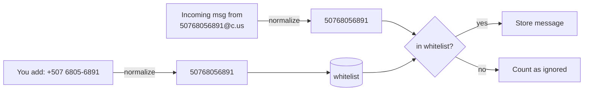

# Whitelist

The whitelist is the allow-list of phone numbers the service will process.
**Only inbound messages from whitelisted numbers are stored.** Everything else
is counted (see `ignored` in `/status`) and dropped — no content is kept.

## Number format — just paste it

You can add a number in **any human format**. The service normalizes it before
storing, so `+`, spaces, dashes, parentheses, and dots are all fine.

Normalization = strip everything that isn't a digit:

```
"+507 6805-6891"     → 50768056891
"+1 (415) 555-0100"  → 14155550100
"14155550100@c.us"   → 14155550100
```

The stored value is **country code + national number, digits only, no `+`**.
A number must be 7–15 digits to be accepted (otherwise `400 Bad Request`).

> Panama example: `+507 6805-6891` → `50768056891` = country code **507** +
> the 8‑digit mobile **68056891**.

## Why that's the WhatsApp-compatible form

WhatsApp identifies a 1:1 chat as `<digits>@c.us`. When a whitelisted contact
messages you, the sender arrives as e.g. `50768056891@c.us`. The whitelist check
runs the **same normalization** on that sender, so it matches your stored entry.



So there's nothing special to format — **digits with country code, no `+`.**

## Managing the whitelist

```bash
# Add (label optional). The response echoes the normalized phone_number.
curl -X POST http://localhost:3000/whitelist \
  -H 'Content-Type: application/json' \
  -d '{"number":"+507 6805-6891","label":"Panama contact"}'

# List
curl http://localhost:3000/whitelist

# Remove — use the normalized digits
curl -X DELETE http://localhost:3000/whitelist/50768056891
```

| Method & path               | Body / notes                                  |
| --------------------------- | --------------------------------------------- |
| `POST /whitelist`           | `{ "number": "...", "label"?: "..." }` — add/update label |
| `GET /whitelist`            | List all entries `{ id, phone_number, label, created_at }` |
| `DELETE /whitelist/:number` | Any format; normalized before matching. `404` if absent |

Adding an existing number just updates its label (idempotent upsert).

## Notes

- **Groups** are ignored by default. Set `MONITOR_GROUPS=true` to also process
  group messages, matched by the *sender's* number against this same whitelist.
- Changes take effect immediately — the in-memory cache is updated on every
  add/remove, so there's no restart needed.
- Test a number after adding it:
  ```bash
  curl http://localhost:3000/messages/50768056891
  ```
